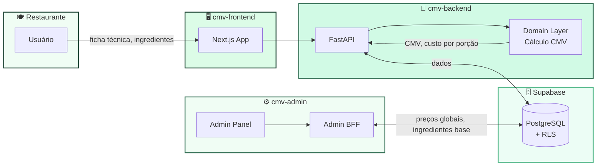

<!-- Header -->

<!-- Badges -->

  
  
  
  

 

**CMV Buffet** é uma plataforma SaaS para restaurantes e buffets calcularem e controlarem 
o **Custo de Mercadoria Vendida** — do ingrediente à ficha técnica, em tempo real.

 

<a href="https://app.cmvbuffet.com.br">🌐 Aplicativo</a> &nbsp;·&nbsp;
<a href="https://admin.cmvbuffet.com.br">⚙️ Admin</a>

  

---

## ⚡ Como funciona

 

## 🧮 O que resolve

<table>
<tr>
<td width="50%">

### 📊 Cálculo de CMV em tempo real
Fichas técnicas com rendimento, fator de correção e desperdício. O custo por porção é recalculado automaticamente a cada atualização de preço de ingrediente.

### 🧾 Fichas técnicas completas
Cadastre receitas com múltiplos ingredientes, unidades de medida, conversões automáticas e modo de preparo. Gere PDFs prontos para a cozinha.

</td>
<td width="50%">

### 💰 Histórico de preços de ingredientes
Rastreie a variação de preço ao longo do tempo. Saiba exatamente quando seu CMV subiu e por quê — sem surpresas no final do mês.

### 🏢 Multi-estabelecimento
Gerencie vários restaurantes ou unidades com um único login. Dados isolados por estabelecimento, com controle de acesso por papel.

</td>
</tr>
</table>

 

## 🛠 Tech Stack

### Frontend

  
  
  
  

### Backend

  
  
  
  

### Infraestrutura

  
  
  
  
  

### Dev & CI

  
  
  
  

 

## 📦 Repositórios

| Repo | Descrição | Stack |
|:-----|:----------|:------|
| **cmv-frontend** | Aplicativo do restaurante — fichas técnicas, ingredientes, CMV | Next.js · TypeScript · Tailwind |
| **cmv-backend** | API do restaurante — cálculo de CMV, domínio de negócio | Python · FastAPI |
| **cmv-admin** | Painel administrativo — gestão global de ingredientes e preços | Next.js · TypeScript |
| **cmv-admin-backend** | API administrativa — preços base, ingredientes globais | Python · FastAPI |

 

## 👤 Sobre o criador

<table>
<tr>
<td>

**Daniel Camargo** — Engenheiro full-stack, especialista em automação e gestão de restaurantes.

Construindo o CMV Buffet para que qualquer restaurante possa controlar custos com precisão — sem planilhas.

  
  

</td>
</tr>
</table>

 

<!-- Footer -->

